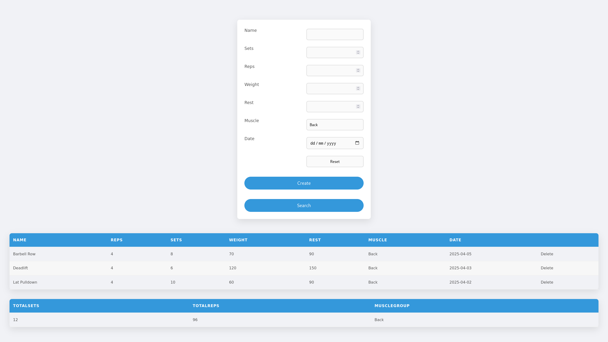
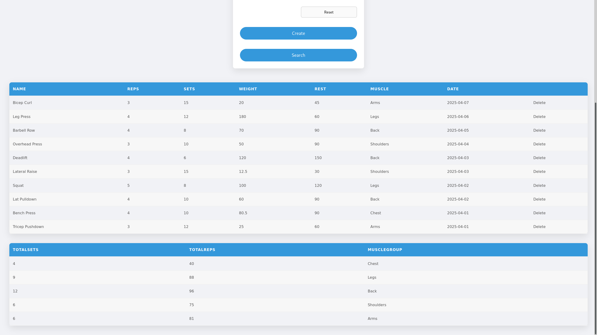

# Workout Logger

A simple workout logger to track and filter your exercise routines.

## Features

- **Log** your workout data.
- **Filter** specific workouts or exercises.
- View data about your fitness routine.

## Built With

- **Backend (API Server):** Java Spring
- **Database:** MySQL
- **Frontend:** JavaScript, HTML, CSS
- **Build and CI:** Maven
- **Deployment:** Docker

## Prerequisites

Ensure you have the following installed:

- [Docker](https://www.docker.com/)
- [Docker Compose Plugin](https://docs.docker.com/compose/install/)

## How to Run

1. Clear ports: 80, 8080, 3306

2. Clone the repository:

   ```bash
   git clone git@github.com:shmador/java-sql-app.git

3. Go to the repository directory:
   
   ```bash
   cd java-sql-app

4. Run:
   
   ```bash
   docker compose up

5. Access the website on localhost:80


